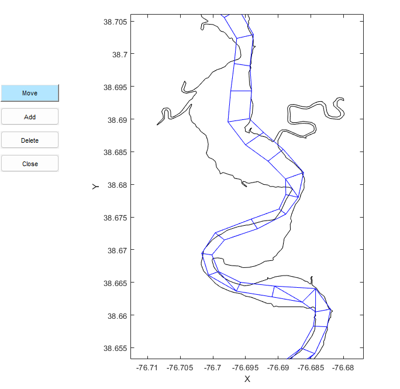
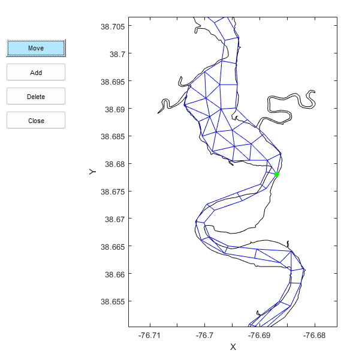

## interactive_mesh_edit

This function provides a lightweight mesh-editing tool tailored for 2-D unstructured grids. It supports grid optimization through convenient node operations, including moving, adding, and deleting nodes. It's part of the [SCHISM-toolbox](https://github.com/wenfanwu/schism-toolbox) but can be also used for other unstructured models. The figures below illustrate the grid structure before and after mesh modification.

<table>
  <tr>
    <td></td>
    <td></td>
  </tr>
</table>
